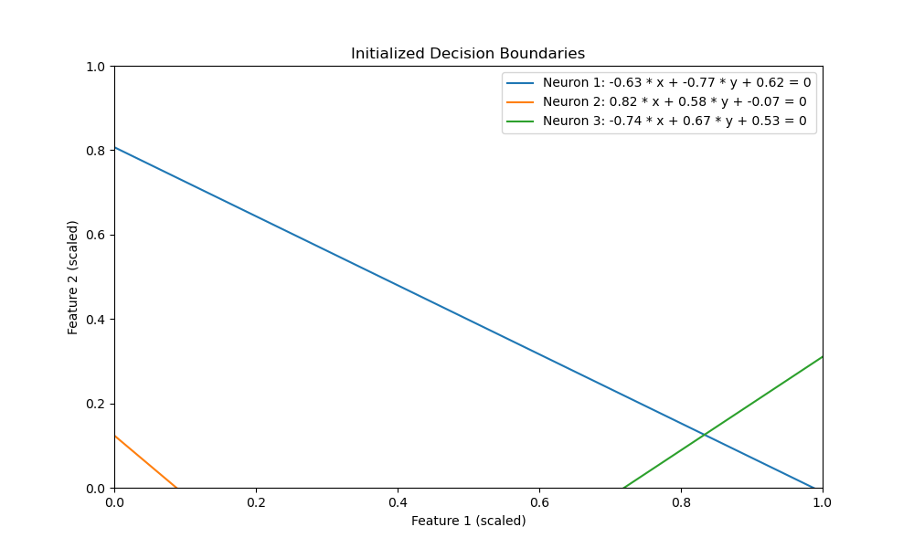
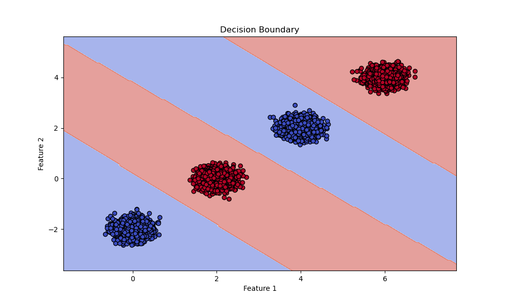

# Minimal Neural Network Decision Boundary Visualization

A PyTorch implementation designed to demonstrate how a minimal neural network can learn decision boundaries for custom-generated datasets that can be separated using piecewise linear boundaries.

## Overview

This project aims to:

- **Generate custom datasets** with specified cluster parameters.
- **Define and train a minimal neural network** with PyTorch, specifically tailored for datasets separable by piecewise linear boundaries.
- **Visualize the initialized decision boundaries** before training.
- **Visualize the final decision boundary** after training.
- **Extract and print the equations** of the decision boundary lines in the original feature space.

## Features

- Customizable data generation with clusters of specified centers, standard deviations, number of samples, and labels.
- Minimal neural network architecture suitable for learning linear decision boundaries.
- Visualization of both initial and trained decision boundaries.
- Extraction of the equations of the decision boundaries in the original feature space.

## Important Notes

1. **Data Requirement**: The algorithm is designed **only for data that can be separated with piecewise linear boundaries**. It assumes that the classes can be separated using straight lines in 2D space.

2. **Manual Definition of Lines**: The **number of linear boundaries (lines) required to separate the classes should be defined manually**. This number determines the minimal number of neurons in the hidden layer.

3. **Optimal Performance**: Optimal performance **cannot be guaranteed**. The results highly depend on the **initialization of the weights** in the neural network. Careful initialization is crucial for the network to learn the correct decision boundaries.

## Approach Description

### Minimal Neural Network Architecture

- **Input Layer**:
  - **Neurons**: 2 neurons corresponding to the two dimensions of the input space.

- **Hidden Layer**:
  - **Number of Neurons**: Each neuron represents a linear boundary (a line in 2D space). Therefore, the number of neurons in the hidden layer should at least equal the number of linear boundaries required to separate the classes.
  - **Activation Function**: A non-linear activation function like **ReLU** (Rectified Linear Unit) is used to introduce non-linearity, enabling the modeling of complex decision boundaries.

- **Output Layer**:
  - **Neurons**: 1 neuron with a **sigmoid** activation function (suitable for binary classification) to output the class probabilities.

### Determining the Minimal Number of Hidden Neurons

- **Linear Boundaries Required**: Analyze the data to determine the **minimum number of linear segments** needed to separate the classes.
- **Hidden Neurons**: Each hidden neuron corresponds to one linear boundary. Therefore, the minimal number of hidden neurons equals the minimal number of linear boundaries required.
- **Conclusion for General Solution**: The minimal architecture is a **2-input, *k*-hidden neurons, and 1-output neural network**, where *k* is the minimal number of linear boundaries needed to separate the classes.

### Initialization of Weights

To ensure that the initial decision boundaries (lines) are uniformly distributed within the unit square, we initialize the weights of the neural network as follows:

1. **Generate $\theta$ uniformly in the range $[0, 2\pi)$:**

   This ensures uniform coverage of all possible orientations of the lines.

2. **Sample a point $(x_{0}, y_{0})$ uniformly from the perimeter of the unit square $[0, 1] \times [0, 1]$:**

   This ensures that the lines pass through points uniformly distributed along the boundary of the unit square.

3. **Compute weights $w_1$ and $w_2$:**
  $$w_1 = \sin(\theta), \quad w_2 = \cos(\theta)$$

   This defines the orientation of the line.

4. **Compute the bias $b'$:**

  $$b' = - (w_1 x_0 + w_2 y_0)$$

   This ensures that the line passes through the point $(x_0, y_0)$.

5. **Use the line equation with the obtained parameters:**

  $$w_1 x + w_2 y + b' = 0$$

**Note:**

- This method ensures that all lines lie within the unit square and are uniformly distributed in both position and orientation.
- By initializing the weights and biases in this manner, the network starts with a diverse set of decision boundaries, improving its ability to learn the correct boundaries during training.

## Installation

### Dependencies

- Python 3.11
- NumPy
- Matplotlib
- Scikit-learn
- PyTorch

### Install Dependencies

You can install the required packages using pip:

```bash
pip install numpy matplotlib scikit-learn torch
```

## Usage

Run the script:

```bash
python main.py
```

## Customization

### Defining the Number of Lines for Separation

- **Manual Setting**: In the `main()` function, set the `hidden_size` variable to the number of linear boundaries you need. This determines the number of neurons in the hidden layer.

  ```python
  hidden_size = k  # Replace k with the number of linear boundaries
  ```

### Customizing the Dataset

You can customize the dataset by modifying the `cluster_params` variable in the `main()` function. Three examples are provided:

- **General Lines** (currently active)
- **Horizontal Lines** (commented out)
- **Vertical Lines** (commented out)

## Example Output


*Initialized Decision Boundaries*


*Final Decision Boundary*

## Functions

### `generate_custom_data(cluster_params)`

Generates a dataset with customizable clusters.

### `MinimalNN(nn.Module)`

Defines the minimal neural network architecture.

### `train_model(model, criterion, optimizer, dataloader, num_epochs)`

Trains the neural network.

### `visualize_results(model, X, y, scaler)`

Visualizes the data and decision boundary.

### `get_decision_boundary_lines(model, scaler)`

Extracts the equations of the decision boundary lines in the original feature space.

### `visualize_initialized_lines(model)`

Visualizes the lines represented by the neurons before training.
